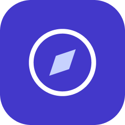

 
 

 
 

# Plat PASS 🚗

이 프로젝트는 카풀하시는 분들을 위한 간단한 사이드 프로젝트입니다.

- 🚗 모두를 위한 카풀 서비스
- 🙏 관악구 한정 ( 동작구 일부지역 가능 )
- ☕️ 커피 한잔 사주시면 더 좋습니다
- 💵 그렇게 안비싸요~

플랫 패스는 서비스개발 1팀 내의 일부 지역 주민을 대상으로 하는 카풀 서비스 입니다. `react`를 이용하였으며 차세대 개발 툴인 `vite`를 이용하여 제작되었습니다.

이 프로젝트는 다음과 같은 핵심 목표가 있습니다.

- `recoil`과 `tanstack-query`를 이용한 유기적 개발
- `thin.dev`를 이용한 서버리스 구조
- `Figma`를 통한 사용자 친화적인 디자인
- **최대한 그럴듯한 README.md 작성**
- 포트폴리용이 아닌 실제 사용자를 대상으로 한 SPA 서비스
   
   

# 사용 모듈

| Package    | Version |
| ---------- | ------- |
| react      | 18+     |
| typescript | 4.8+    |
| vite       | 3+      |
| ...        | ...     |

 
 

# 기여

@dus532 (정연진)
 
 

# 라이센스

MIT
 
 
